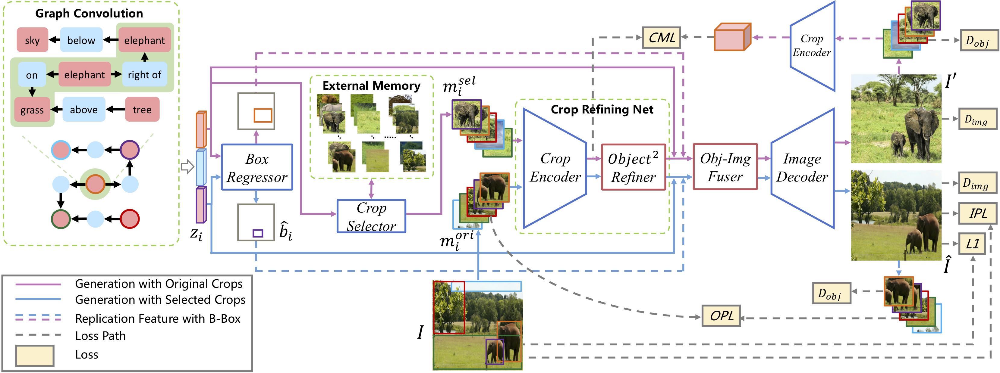

# PasteGAN: A Semi-Parametric Method to Generate Image from Scene Graph

This is a pytorch project for the paper [**PasteGAN: A Semi-Parametric Method to Generate Image from Scene Graph**](https://papers.nips.cc/paper/8650-pastegan-a-semi-parametric-method-to-generate-image-from-scene-graph.pdf) by Yikang Li, Tao Ma, Yeqi Bai, Nan Duan, Sining Wei and Xiaogang Wang presented at **NeurIPS 2019**.




## Project Outline

Here is how the project is arranged and developed:
- utils: utility functions used in the project
	- visualization: functions to visualize the results
	- common.py: common functions/tools used in the project
	- ...
- scripts: scripts used for data proprocessing / project setup / data downloading
- models: (commond functions can be placed here and detailed module/models should be place in the correponding folders)
	- utils: model-related utilities
	- modules: Basic modules used in the model
- options: Model/Training settings related files
- data: (optional, ignored by .gitignore) to store the data
	- coco: COCO dataset
	- visual_genome: Visual Genome Dataset
- output: Store the checkpoint and related output


## Notations

Here is a list of the notations used in the project:
- **selected_crops**: The object crops selected by **Selector** from the external memory tank, playing a role of the source materials of generation.
- **original_crops**: The object crops extracted from the corresponding ground-truth images, playing a role of the source materials of reconstruction.
- **canvases_sel**: A canvas produced by simply superimposing the selected object crops with the ground-truth bounding boxes together.
- **canvases_ori**: A canvas produced by simply superimposing the original object crops with the ground-truth bounding boxes together. It is almost the same as ground-truth image if the object annotation is completely marked.

We only use **canvases_sel** and **canvases_ori** for visualizing the training process.

## DATA
The DATA used in our project can be downloaded from [here](https://drive.google.com/drive/folders/1zFhIbQo_3_CkHZVs5ZW7DBD6k9fsn1-K?usp=sharing).

## Project Setup

First install Python 3 (we don't provide support for Python 2). We advise you to install Python 3 and PyTorch with Anaconda:

```
conda create --name py36 python=3.6
source activate py36
conda install pytorch torchvision -c pytorch
conda install -c hcc pycocotools
```

Clone the repo (with the --recursive flag for submodules) and install the complementary requirements:
```
cd $HOME
git clone --recursive git@github.com:yikang-li/PasteGAN.git
cd PasteGAN
pip install -r requirements.txt
```

Prepare dataset:
- Download COCO Dataset: `sh scripts/download_coco.sh`
- Download VG Dataset: `sh scripts/download_vg.sh`
- We advise you to straightly download the required data at [dataset](https://github.com). (The code of dataset preprocessing is under cleaning, we will release the code as soon as possible.)


## Some Training Tips

Here are some training Tips:
- For 64x64 images, we usually use 2 cards with batch size 16. Please make sure it can be divided by the number of GPUs
- An example training command: `CUDA_VISIBLE_DEVICES=0,1 python train.py --path_opt options/vg/paste_gan_vg.yaml --batch_size 16`


## Some Test Tips

Here are some test Tips:
- Run the script on 1 GPU and let batch size equal 1.
- Set num_val_samples a big number to get the inception score on whole val set.
- An example command:
```CUDA_VISIBLE_DEVICES=0 python test.py --path_opt options/vg (or coco)/xxxx.yaml --batch_size 1 --checkpoint_start_from output/xxxx/best_with_model.pt --num_val_samples 1000000```


## Citation Information

If you find the project useful, please cite:

```
@article{li2019pastegan,
  title={PasteGAN: A Semi-Parametric Method to Generate Image from Scene Graph},
  author={Li, Yikang and Ma, Tao and Bai, Yeqi and Duan, Nan and Wei, Sining and Wang, Xiaogang},
  journal={NeurIPS},
  year={2019}
}
```
